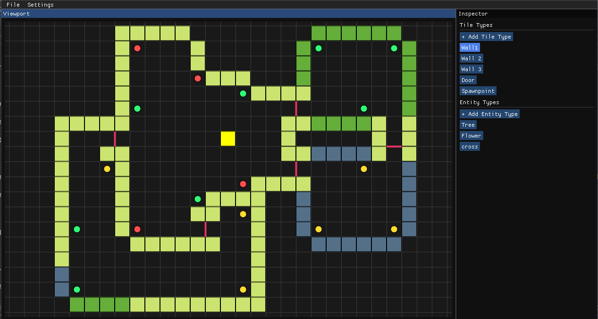
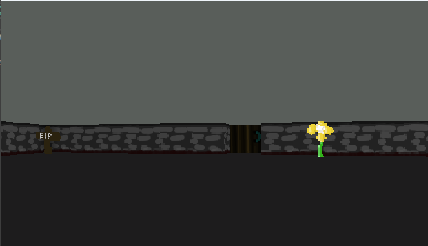

# QRay Engine

A WIP raycasting game engine.

## Usage

1. Build both the QRayEditor.exe and the QRayRuntime.exe and make sure they are in the same folder.

2. Open QRayEditor.exe

3. Choose whether to Open previous projects (.qray files) or make a new one.

4. Add a tile type (a new texture) by clicking "+ Add Tile Type" on the inspector panel.

5. You can also add an entity type by clicking "+ Add Entity Type" on the inspector. Note that currently only static entities are supported. Also the tag system has not been implemented yet, so leave that at 0.

6. Select a tile or entity from the list and left-click on the grid to place it there. Use right-click to remove tiles and entities.

7. You can change the game title from Settings -> Project settings.

8. You can build the game by going File -> Build, and choosing a location to build.

## Latest features

The entity and door tagging system works sort of... And entity collisions work also!

This repo also features an example project, and the game built from that. Also there's some textures for experimenting!
Keep in mind the game is built using Debug binaries, so the file size is bigger than usual.

## TODO

Here's a list of features that I consider are "high priority"

- Moving entities
- Some kind of ui support
- Weapons
- Better visualizing of the map in the editor
- Better documentation of the features

Things below are not necessarily needed but would be nice to have

- Multiple map support? (Load new map after getting to a specific point in the previous one)
- HTML build target (using HTML5 Canvas or WebGL)
- "View bobbing" when running